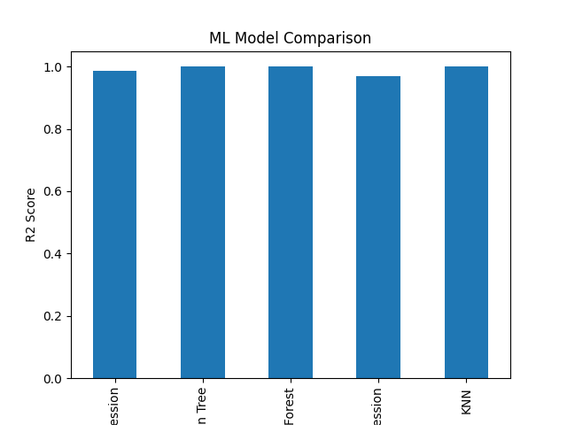

# Simulation-Based Data Generation for Machine Learning using Cantera

## 📖 Overview

This project demonstrates a complete workflow for **physics-based data generation using chemical simulation** and subsequent **machine learning model development**.

Using the **Cantera chemical kinetics library** with the GRI 3.0 mechanism, thermodynamic properties are simulated for methane-air combustion under varying temperature and pressure conditions. The generated dataset is then used to train and evaluate multiple regression models.

The objective is to bridge **scientific simulation** and **data-driven modeling** in a structured and reproducible manner.

---

## 🎯 Project Objectives

- Generate synthetic thermodynamic data using a validated chemical mechanism
- Store simulation results in structured dataset format
- Apply multiple regression algorithms
- Compare models using standard evaluation metrics
- Visualize and save model performance results

---

## 🧪 Simulation Configuration

| Parameter | Value |
|------------|--------|
| Mechanism | `gri30.yaml` |
| Fuel | Methane (CH₄) |
| Oxidizer | O₂ : 1, N₂ : 3.76 |
| Equivalence Ratio | 1.0 |
| Temperature Range | 800 K – 1500 K |
| Pressure Range | 1 atm – 10 atm |
| Number of Simulations | 1000 |
| Target Variable | Specific Heat (cp) |

The thermodynamic property used as the prediction target is:

> **Specific Heat at Constant Pressure (cp)**

---

## 🧠 Machine Learning Models Implemented

The following regression models were trained and evaluated:

- Linear Regression
- Decision Tree Regressor
- Random Forest Regressor
- Support Vector Regression (SVR)
- K-Nearest Neighbors (KNN)

### 📊 Evaluation Metrics

- Mean Squared Error (MSE)
- Mean Absolute Error (MAE)
- R² Score

Model performance comparison is based primarily on the **R² Score**.

---

## 📈 Model Performance Visualization

The trained models are compared visually using a bar plot of R² scores.

### Saved Output Graph:

This graph is automatically generated and saved as:

